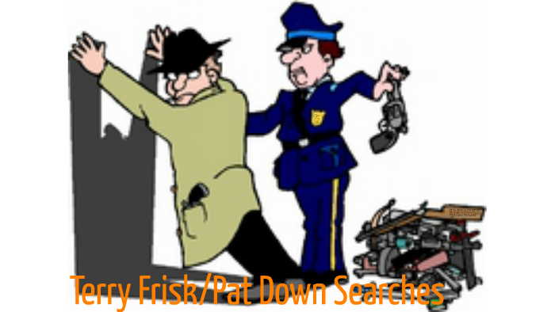
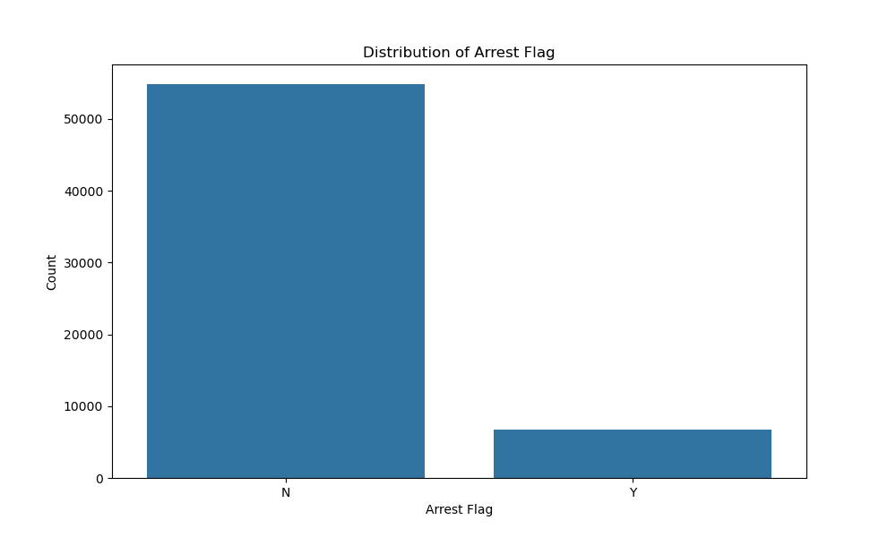
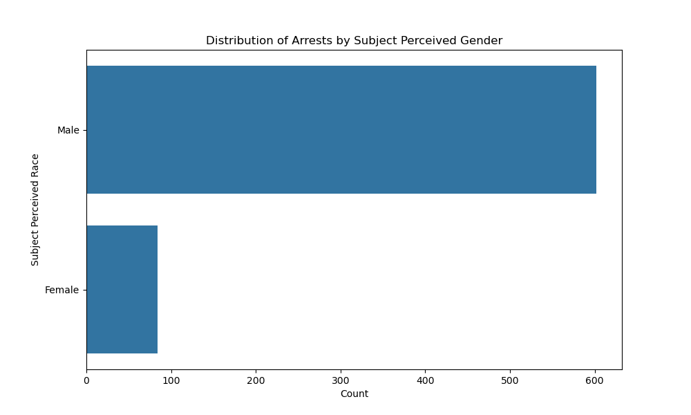
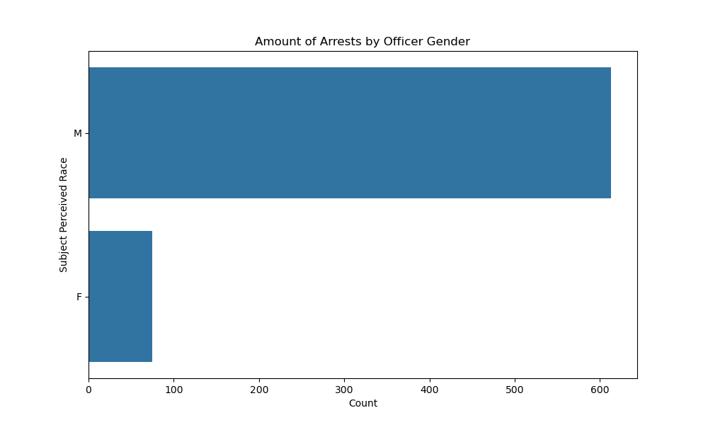
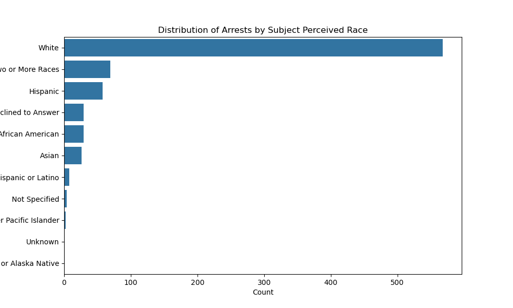
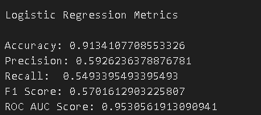
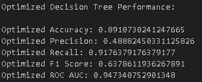
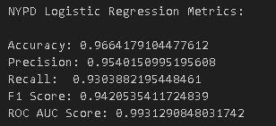
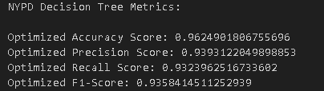

# Terry Stops Phase3

# Overview

The purpose of this project is to perform an analysis using the seattle police department database. We have been asked to  provide valuable insight regarding the outcome of Terry stops performed that led to a persons arrest.
As well as a predictive model that can be used to make recommendations to the Police Department to help determine if Terry Stops are neccessary.

# Business Understanding

The police department would like to determine the number of arrests made from Terry Stops aka Stop, Search, and Frisk stops that resulted in a persons arrest.

Using data from Seattle PD Data portal, we would like to detrmine the key features that predict an arrest and make appropriate recommendations.

# Data and Methodology

Data regarding arrest in the city of Seattle was given in one single CSV file. The Dataset contained 61,000+ rows, each pertaining to a reported incident ranging from a number of reported crimes or incidents (reported time, date, etc.) that well called into the police department.
Visualizations of data and brief explanations can be found in the "index" notebook.

We used the follow Datasets:

[Seattle Terry Stop DB](https://data.seattle.gov/Public-Safety/Terry-Stops/28ny-9ts8/about_data) contains dinformation regarding arrests, incident calls, and frisk performed.

[NYPD Stop and Frisk DB](https://www.nyc.gov/site/nypd/stats/reports-analysis/stopfrisk.page)

**Target Selection**
For this project, the **Target variable** is set to indicate whether an individual was arrested or not from a terry stop. This is represented by:

* **"Arrest Flag"**, this is based on if the individual was arrested or not within the seattle PD dataset. 
* **"SUSPECT ARRESTED FLAG"**, in the NYPD dataset, which similarily indicates if the indivisual was arrested.

# EDA

During my analysis, I investigated the distribution of the target variables and the features to identify trends, relationships, and potential in the data.

1. **Target Column Analysis**
* Both **"Arrest Flag"** and **"SUSPECT ARRESTED FLAG"** are **imbalanced**, with far fewer arrests(positive cases) compared to non-arrests (negative cases). This imbalance has implications for model training, as it may require additional techniques to handle the disparity effectively.

2. **Feature Importance**

* Based on the analysis, I found the following features were relevant to predicting arrests:

* **Final Call Type**: The nature of the call plays a component in whether the officers are looking for a particular person based on the type of incident. 
* **Stop Resolution**: The outcome of the police interaction often correlate with arrests.
* **Officer Gender**: This identifies the offiers Gender that made the arrest
* **Officer Race**: Arrest likelihood varies based on the perceived gender of the officer.
* **Subject Perceived Gender**: Arrest likelihood varies based on the perceived gender of the subject.
* **Subject Perceived Race**: Significant disparities in arrest rates are observed across racial groups.
* **Frisk Flag**: Incidents involving a frisk are more likely to result in arrests. Inidicated by Y or N.

* Key Visualizations and Insights

**Exploring Arrests**

The overall distribution of arrests demonstrates the imbalance in the target variable

**Exploring Subject Gender**

* The majority of reported arrests involve individuals perceived to be **Male**.
* This suggests potential gender-based differnce in interactions or reporting practices.

**Exploring Officer Gender**

* Most arrests are performed by officers identified as **Male**
* This could reflect the gender composition of the police force or other structural factors.

**Exploring Subject Race**

* A large porportion of arrests involve individuals perceived as being of White descent, followed by Black or African American descent.
* These findings highlight potential biases or systemic patterns in policing practices that warrant further investigation

# Models

Performing Logistic Regression and Decision Tree Classification, we find the following metrics:

* For Seattle PD

* NYPD

# Conclusion

The model demonstrates excellent performance, achieving high accuracy (96.25%) and a strong ROC AUC score (98.48%). These results suggest it has strong potential for deployment in predicting arrests from Terry stops. However, ethical considerations and fairness analyses are crucial to ensure its responsible and unbiased use.

# Next Steps

Based on the model's performance, the following steps are recommended:

* Conduct fairness evaluations to identify and address potential biases.
* Adjust the decision threshold for precision or recall optimization based on use-case priorities.
* Test the model in a real-world pilot program to validate its effectiveness and identify areas for improvement.

# For more information

See the full analysis in the [Jupyter Notebook](https://github.com/omendez930/Terry-Traffic-Stops-Phase3/blob/main/index.ipynb) and [Presentation](https://github.com/omendez930/Terry-Traffic-Stops-Phase3/blob/main/Terry%20Stops.pdf)

If you're interested in the visualizations, you can check it out here: [Tableau link](https://public.tableau.com/app/profile/orangel.mendez/viz/Terrt_stop_analysis/Dashboard1?publish=yes)

Orangel Mendez: <omendez30@gmail.com>

